<!--
PROFILE README TEMPLATE

How to use:
1. Create a public repository named exactly YOUR_USERNAME
2. Copy this README.md and the /assets folder into that repository
3. Replace every YOUR_* placeholder below
4. Edit ./assets/hero-terminal.svg if you want to change the banner text
5. URL placeholders should include the full protocol, for example https://example.com

Tip:
- GitHub may cache SVG assets for a while after you push changes
- Commit again or rename the file if the banner does not refresh immediately
-->

<p align="center">
  
</p>

<h1 align="center">杨屹轩</h1>

<p align="center">
  <strong>YOUR_TAGLINE</strong><br />
  Building products with sharp visuals, fast systems, and real signal.
</p>

<p align="center">
  <a href="https://github.com/Tonysuperman?tab=followers">
    
  </a>
  <a href="https://github.com/YOUR_USERNAME">
    
  </a>
  <a href="mailto:YOUR_EMAIL">
    
  </a>
</p>

<p align="center">
  <a href="YOUR_PORTFOLIO_URL">
    
  </a>
  <a href="YOUR_LINKEDIN_URL">
    
  </a>
  <a href="YOUR_X_URL">
    
  </a>
  <a href="YOUR_BLOG_URL">
    
  </a>
</p>

<table>
  <tr>
    <td width="58%" valign="top">

<h3>SIGNAL</h3>

<pre lang="ts"><code>const operator = {
  role: "YOUR_ROLE",
  base: "YOUR_LOCATION",
  focus: ["AI Products", "Creative Frontend", "Automation"],
  building: "YOUR_CURRENT_BUILD",
  principle: "Clarity beats noise. Shipping beats theater."
};</code></pre>

<h3>WHAT I SHIP</h3>

<ul>
  <li>Interfaces with identity, not template energy</li>
  <li>Tools that compress complexity into something people can use</li>
  <li>Systems that move fast without feeling fragile</li>
  <li>Visual experiences that still respect engineering rigor</li>
</ul>

<blockquote>I do not build generic pages. I build surfaces that leave a signal.</blockquote>

    </td>
    <td width="42%" valign="top">

<h3>LIVE STATUS</h3>

<pre lang="txt"><code>MODE      : BUILD / ITERATE / DEPLOY
STACK     : TS / PY / REACT / NODE / OPENAI
TIMEZONE  : UTC+8
OPEN FOR  : YOUR_COLLAB_TYPES</code></pre>

<h3>CURRENT LOOP</h3>

<pre lang="txt"><code>[01] Shipping: YOUR_ACTIVE_PROJECT
[02] Exploring: YOUR_EXPERIMENT
[03] Learning: YOUR_LEARNING_TRACK
[04] Reading : YOUR_CURRENT_BOOK_OR_TOPIC</code></pre>

<h3>DIRECT LINES</h3>

<ul>
  <li><a href="YOUR_PORTFOLIO_URL">Portfolio</a></li>
  <li><a href="YOUR_LINKEDIN_URL">LinkedIn</a></li>
  <li><a href="YOUR_X_URL">X / Twitter</a></li>
  <li><a href="mailto:YOUR_EMAIL">Email</a></li>
</ul>

    </td>
  </tr>
</table>

### BUILD MATRIX

<p>
  
  
  
  
  
  
  
  
  
  
</p>

### FEATURED DROPS

| Drop | What it is | Stack | Links |
| --- | --- | --- | --- |
| `PROJECT_01` | One sharp line that explains the product and why it matters. | `Next.js` `TypeScript` `OpenAI` | [Live](YOUR_PROJECT_01_URL) / [Code](https://github.com/YOUR_USERNAME/YOUR_PROJECT_01_REPO) |
| `PROJECT_02` | Something visual, useful, and technically clean. | `React` `Node.js` `PostgreSQL` | [Live](YOUR_PROJECT_02_URL) / [Code](https://github.com/YOUR_USERNAME/YOUR_PROJECT_02_REPO) |
| `PROJECT_03` | A tool, automation flow, or system with clear leverage. | `Python` `FastAPI` `Docker` | [Live](YOUR_PROJECT_03_URL) / [Code](https://github.com/YOUR_USERNAME/YOUR_PROJECT_03_REPO) |

### GITHUB SIGNAL

<p>
  
  
</p>

<p>
  
</p>

### NOW

```txt
DESIGNING       :: YOUR_PRIMARY_DIRECTION
OPTIMIZING      :: YOUR_SYSTEM_OR_WORKFLOW
EXPERIMENTING   :: YOUR_NEW_IDEA
COLLABORATING   :: YOUR_IDEAL_PROJECT_TYPE
```

### MANIFEST

```txt
Good software is not just functional.
It should read clearly, move quickly,
and feel like somebody cared about the details.
```
